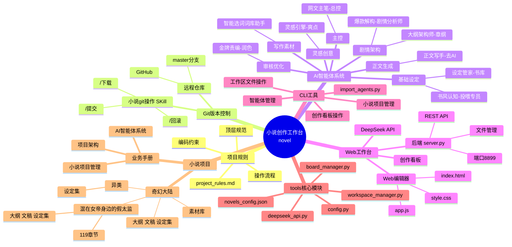
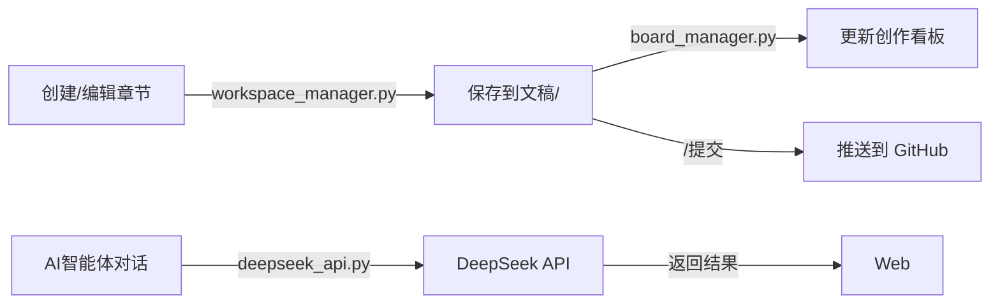

# 小说创作工作台 — 项目脑图



---

## 项目关系图

```mermaid
flowchart TD
    User[用户] -->|浏览器访问 :8899| Web[Web编辑器]
    Web -->|API请求| Server[server.py]
    Server -->|读写| WM[workspace_manager.py]
    Server -->|读写| BM[board_manager.py]
    Server -->|调用| DS[deepseek_api.py]
    DS -->|HTTP| API[DeepSeek API]
    WM -->|管理| NovelDir[小说项目目录]
    BM -->|管理| Board[创作看板数据]
    Server -->|静态文件| EditorDir[编辑器前端]

    subgraph CLI
        CLI[import_agents.py]
        CLI --> WM
        CLI --> BM
        CLI --> DS
    end

    subgraph Git
        GitSkill[小说git操作 Skill]
        GitSkill -->|提交| GitHub
        GitSkill -->|下载| GitHub
    end

    subgraph Manual
        Rules[project_rules.md] -.->|按需读取| Manuals[docs/手册/]
        Manuals -->|AI智能体.md| AI_Detail
        Manuals -->|项目架构.md| Arch_Detail
        Manuals -->|小说项目管理.md| Novel_Mgmt
    end

    CLI -.->|可选替代| User
    GitSkill -.->|AI代理执行| Novel[项目根目录]
```

---

## 数据流


