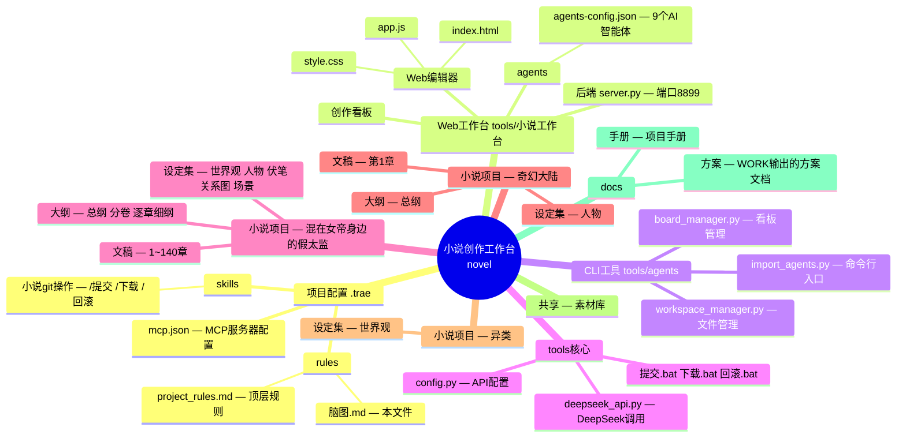
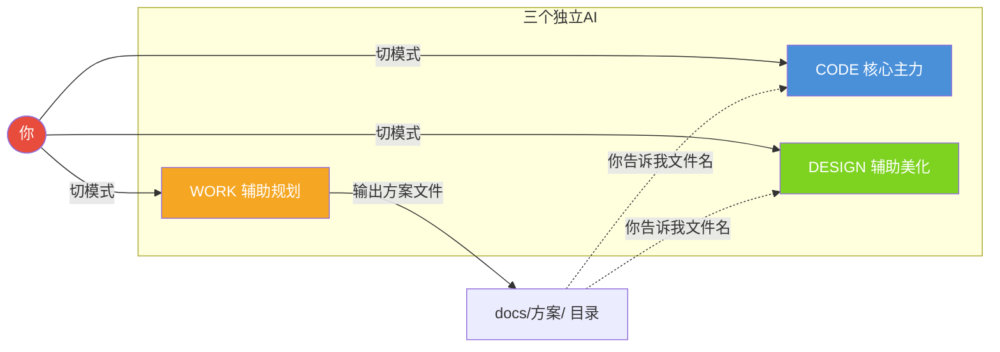
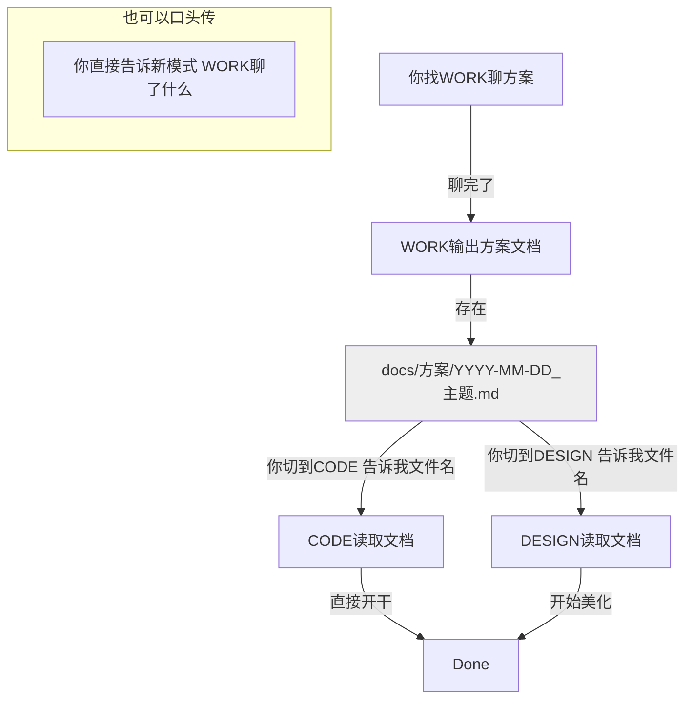
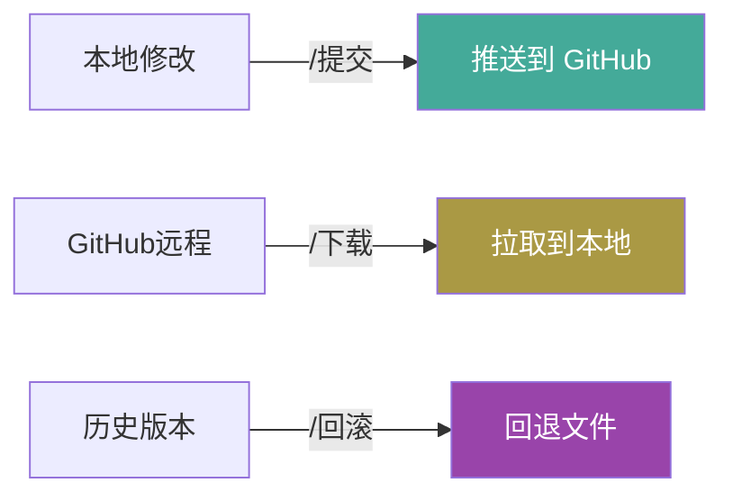
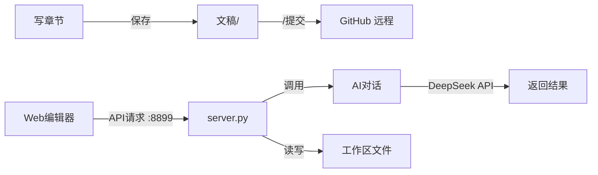

# 小说创作工作台 — 项目脑图

---

## 脑图 A：项目物理结构



---

## 脑图 B：三模式关系（真实版）

三个模式的对话**完全不互通**，各管各的记忆。信息传递靠文件 + 用户口头转述。



---

## 信息传递方式



---

## OpenViking 定位

OpenViking 是**快速检索工具**，不是跨模式信息传递工具。

```
✅ 适用：搜索某条设定在哪、找代码位置、快速查信息
❌ 不适用：存方案、传对话、做跨模式沟通（用文件更可靠）
```

---

## Git版本控制



---

## 数据流


