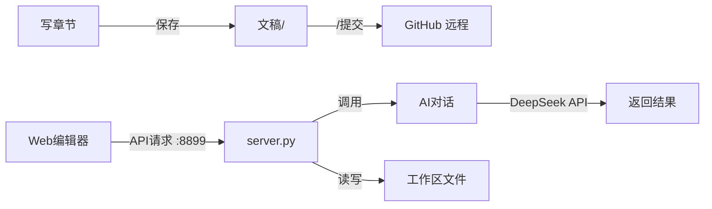

# 小说创作工作台 — 项目脑图

> 版本：v1.00 | 更新：2026-06-25
> 顶层规则见 `project_rules.md`，代码索引见 `docs/code_index.json`

---

## 快速定位

| 入口 | 路径 | 说明 |
|:----|:-----|:-----|
| 顶层规则 | `.trae/rules/project_rules.md` | AI 行为宪法 |
| 项目脑图 | `.trae/rules/脑图.md` | 本文件 |
| 代码索引 | `docs/code_index.json` | @函数名 → 文件路径 |
| 后端服务 | `tools/小说工作台/server.py` | 端口 8899 |
| Web 编辑器 | `tools/小说工作台/编辑器/index.html` | 前端入口 |
| CLI 入口 | `tools/agents/import_agents.py` | 命令行工具 |

---

## 命令

| 命令 | 说明 |
|:----|:------|
| `python tools\小说工作台\server.py` | 启动 Web 工作台（端口 8899） |
| `python tools\agents\import_agents.py` | 启动 CLI 智能体工具 |
| `/提交 [说明]` | 提交到 GitHub（只上传） |
| `/下载` | 从 GitHub 拉取（只下载） |
| `/回滚` | 回退到历史版本 |

---

## 核心模块

### 1. Web 工作台（tools/小说工作台/）

- **定位**：小说创作的主要操作界面，浏览器访问 http://localhost:8899
- **关键文件**：
  - `server.py` — 后端服务器，处理所有 API 请求
  - `编辑器/index.html` — 前端页面
  - `编辑器/app.js` — 前端交互逻辑
  - `编辑器/style.css` — 前端样式
  - `agents/agents-config.json` — 9 个 AI 智能体定义
- **数据流**：浏览器 → API 请求 :8899 → `server.py` → 读写文件 / 调用 DeepSeek API → 返回结果
- **关键函数**：@server.py.main → 启动服务 | @WorkbenchHandler.do_GET/do_POST → API 路由

### 2. CLI 工具（tools/agents/）

- **定位**：命令行下的智能体对话和项目管理工具
- **关键文件**：
  - `import_agents.py` — 主入口，支持对话、管理小说、操作看板
  - `board_manager.py` — 创作看板读写
  - `workspace_manager.py` — 工作区文件管理
- **关键函数**：@import_agents.main → CLI 入口 | @talk_with_agent → 交互对话 | @once_chat → 单次对话

### 3. API 核心模块（tools/）

- **定位**：DeepSeek API 调用和配置
- **关键文件**：
  - `deepseek_api.py` — API 调用封装
  - `config.py` — 配置读取（API Key、模型、地址）
- **关键函数**：@chat_with_agent → 与智能体对话 | @simple_chat → 简单对话

### 4. 项目配置（.trae/）

- **定位**：AI 行为规则和技能定义
- **文件结构**：
  ```
  .trae/
  ├── rules/
  │   ├── project_rules.md     ← 顶层行为规范
  │   └── 脑图.md              ← 本文件
  ├── skills/
  │   ├── 小说git操作/SKILL.md  ← Git 版本控制技能
  │   ├── read-context/SKILL.md ← 读项目技能
  │   └── SKILL模板.md          ← 标准化模板
  └── mcp.json                  ← MCP 服务器配置
  ```

### 5. 文档体系（docs/）

- **定位**：方案文档、业务手册、代码索引
- **文件结构**：
  ```
  docs/
  ├── 方案/          ← WORK 输出的方案文档（YYYY-MM-DD_主题.md）
  ├── 手册/          ← 超过 50 行的业务说明
  │   ├── AI智能体系统.md
  │   ├── 项目架构.md
  │   └── 小说项目管理.md
  ├── 变更记录/       ← 每日变更记录
  ├── code_index.json ← 代码索引（@函数名 → 文件路径）
  ├── checklist-code.json  ← CODE 模式校验清单
  └── checklist-work.json  ← WORK 模式校验清单
  ```

---

## 三模式协作关系


---

## 小说项目

| 项目 | 状态 | 文稿进度 | 设定完整度 |
|:----|:----:|:--------:|:---------:|
| **混在女帝身边的假太监** | 🟢 主推 | 1~140 章 | ★★★★★ |
| **奇幻大陆** | 🟡 起步 | 第 1 章 | ★☆☆☆☆ |
| **异类** | 🔵 设定阶段 | 无 | ★☆☆☆☆ |

共享目录：`素材库/`（写作笔记、参考资料）

---

## 数据流



---

## 脑图维护纪律

- 改代码前：先读脑图定位目标模块
- 改代码后：版本号 +1，日期更新
- 新增/删除模块：更新对应章节
- 修改关键逻辑：更新 ASCII 图和描述
- 增删函数：同步更新 `docs/code_index.json`
