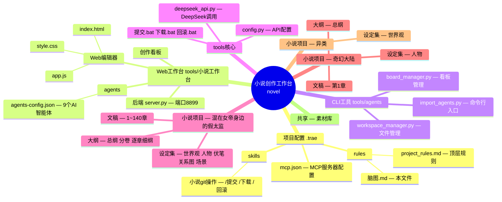
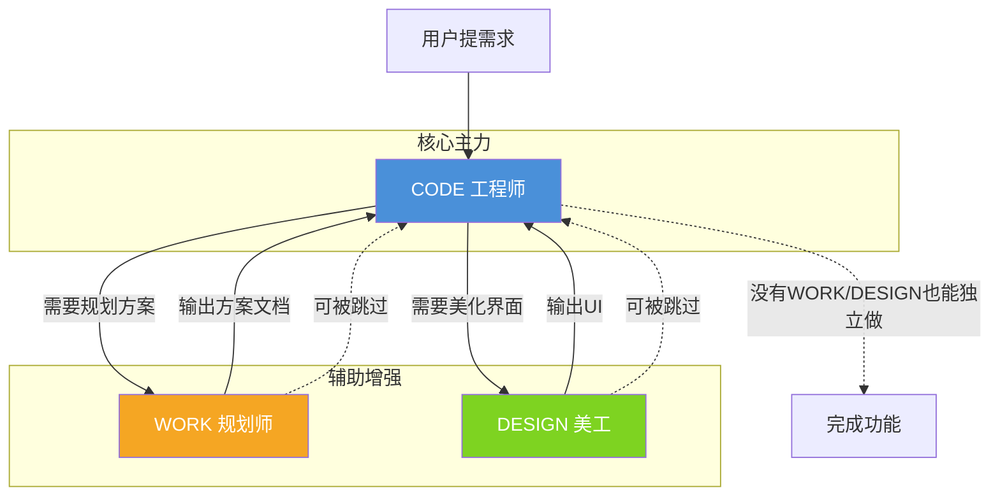
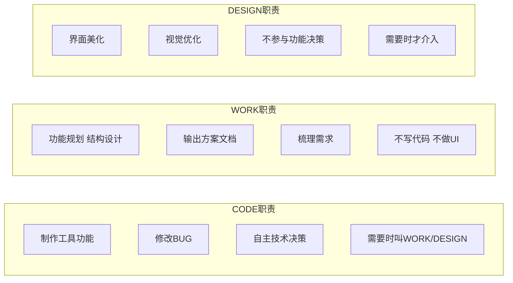
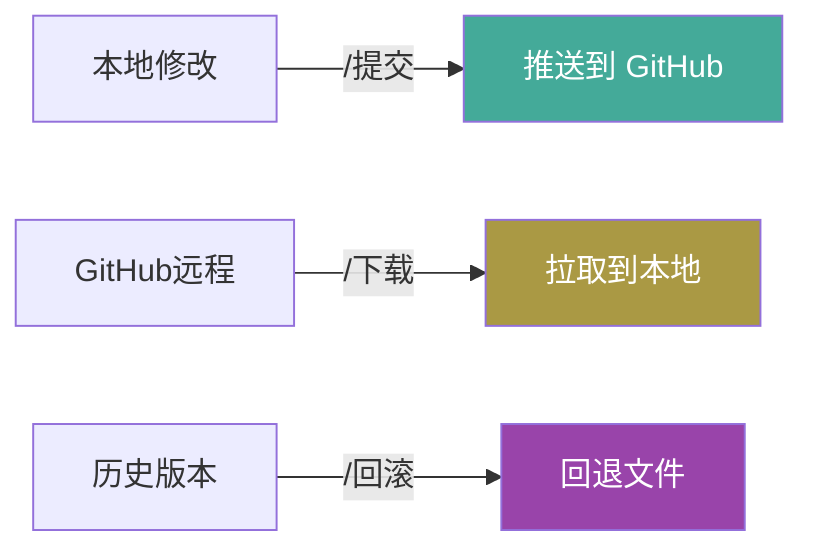
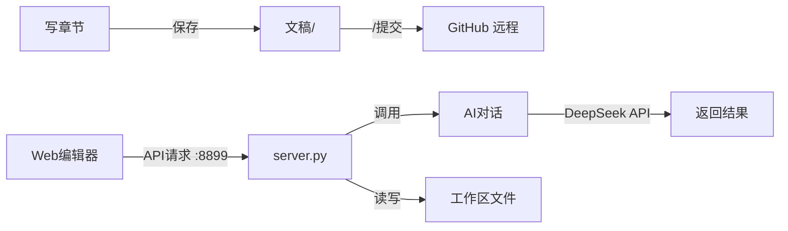

# 小说创作工作台 — 项目脑图

---

## 脑图 A：项目物理结构



---

## 脑图 B：三模式协作关系



---

## 三模式职责明细



---

## 模式切换注意事项

```
模式之间对话不互通
但三份模式共享同一份顶层规则（project_rules.md）

当 CODE 中途需要 WORK 协助时：
  1. CODE 需说明当前进度和遇到的问题
  2. WORK 先读 project_rules.md 了解项目背景
  3. 再基于 CODE 的说明给出方案建议

当 CODE 需要 DESIGN 协助时：
  1. CODE 说明需要美化的具体界面和功能
  2. DESIGN 只做视觉优化，不改功能逻辑
```

---

## Git版本控制



---

## 数据流


